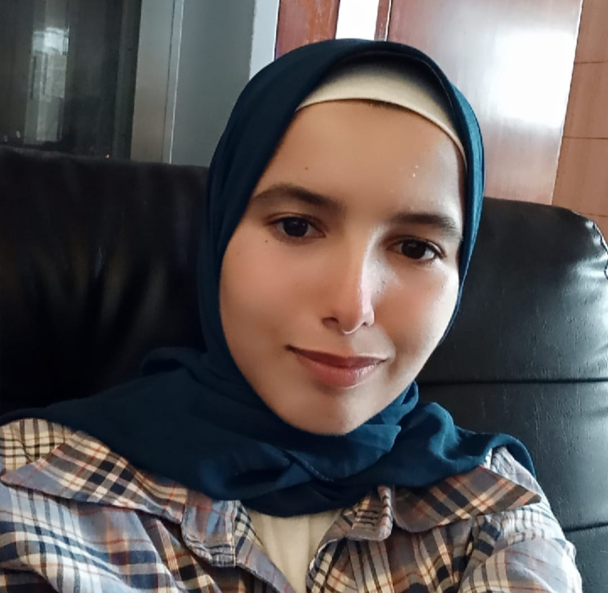
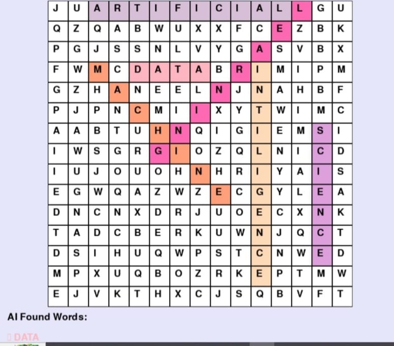

# Menna Allah Ahmed Zakria - Portfolio 💻

Welcome to my portfolio! I am an aspiring *Data Scientist* passionate about turning data into insights. Here you can find my skills, education, projects, and ways to get in touch.

---

## About Me
I’m a curious and persistent Data Science student skilled in *Python, SQL, data visualization tools (Tableau, Power BI), and building projects to grow my **machine learning knowledge*. I enjoy finding patterns in data and sharing them clearly.



---

## Educational Background
- *B.Sc. in Computers and Data Science*  
  Faculty of Computers and Data Science, Alexandria University  
  Second Year Student (2024 – Present)

- *Digital Egypt Pioneers Initiative (DEPI)* – Data Science & AI Track  
  In Progress (2025 – Present)

### Courses & Certifications
- Python Fundamentals – MaharaTech / ITI (2025)  
- Database Fundamentals – MaharaTech / ITI (2025)  
- Python 101 for Data Science – IBM (2025)

---

## Technical Skills
- *Programming Languages:* Python, SQL (Advanced)  
- *Data Analysis:* Pandas, Numpy, Data Cleaning (Medium)  
- *Visualization:* Matplotlib, Seaborn (Medium)  
- *Machine Learning:* Regression, Classification (Beginner)  
- *Tools:* GitHub, Colab Notebook  
- *Soft Skills:* Problem-Solving, Analytical Thinking, Teamwork  

---

## Offered Services
- Data Cleaning & Analysis  
- Exploratory Data Analysis (EDA)  
- SQL Queries & Database Basics  
- Python Scripting for Data Tasks  
- Data Visualization (Matplotlib, Seaborn)  
- Simple Reports & Dashboards  

---

## Professional Projects

### Simple Calculator 🔢
A user-friendly web calculator built with Python and Streamlit for basic arithmetic operations.  
[Try it Online 🔗](https://calculator-app-ardewjczspzmlysqe2slom.streamlit.app/)  


### Word Search Game (2025)
Developed a small game in Python using Pygame and Random libraries. Implemented word search logic and interactive visuals.  



### College System with Data Structures (2025)
Implemented a college management system in Java. Used LinkedList and Stack to handle student/course records efficiently.  


---

## Achievements
- 🏆 Selected for Digital Egypt Pioneers Initiative (DEPI) – Data Science & AI Track (2025)  
- 🏆 Completed Python Fundamentals & Database Fundamentals – MaharaTech/ITI (2025)  
- 🏆 Completed Python 101 for Data Science – IBM (2025)  
- 🏆 Delivered an interactive Data Analysis Dashboard with R Shiny  

---

## Contact Me
- [LinkedIn](https://www.linkedin.com/in/menna-elkafory)  
- [GitHub](https://github.com/mennaelkafory)  
- [Email](mailto:mennaelkafory26@gmail.com)  
- [Phone](tel:+201202647566)  

---

## How to Run the Portfolio Locally
1. Clone the repository:  
   ```bash
   git clone https://github.com/mennaelkafory/your-repo-name.git